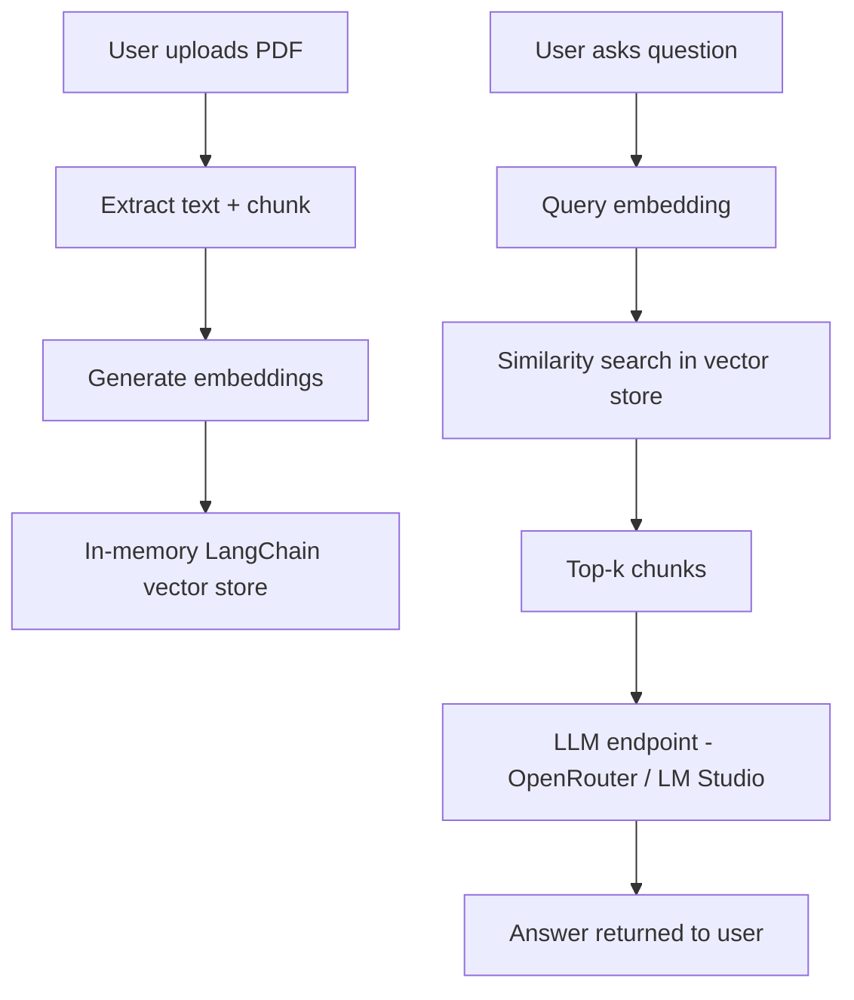

# Mini PDF Q\&A - Next.js (RAG using endpoint LLMs)

Small app to upload a PDF and ask questions about its content. Uses a simple in-memory LangChain-style store and endpoint-based LLMs for retrieval augmented generation.

## Quick setup

1. Clone repo and install dependencies:

   ```bash
   npm install
   ```

2. Create .env.local with these variables (example values, do not commit real keys):

   ```env
   PROTECTED_API_KEY=changeme
   OPENROUTER_API_KEY=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
   LM_STUDIO_ENDPOINT=http://127.0.0.1:1234/v1
   EMBEDDING_MODE=hf
   SESSION_EXPIRY_SECONDS=3600
   ```

3. Start dev server:

   ```bash
   npm run dev
   ```

Note - replace example keys before publishing. Keep keys out of source control.

## How it works - short

* User uploads a PDF to POST /api/upload.
* Server extracts text, chunks it, creates embeddings, and stores them in an in-memory vector store per session.
* User sends question to POST /api/ask with session\_id.
* Server finds top-k chunks, composes a RAG prompt, queries the endpoint LLM, and returns an answer plus sources.

## API endpoints

* **POST /api/upload** - accepts multipart PDF, returns `{ session_id, num_chunks, approx_chars }`.
* **POST /api/ask** - accepts `{ session_id, question, top_k? }`, returns `{ answer, sources, used_model }`.

API protection - include header:

* `X-PROTECTED-KEY: <PROTECTED_API_KEY>`

## Models and endpoints

* **Option A – OpenRouter (cloud)**

  * Text model: `openai/gpt-4o-mini`
  * Embedding model (fallback): `sentence-transformers/all-MiniLM-L6-v2`
* **Option B – LM Studio (local)**

  * Endpoint: [http://127.0.0.1:1234/v1](http://127.0.0.1:1234/v1)
  * Text model: `openai/gpt-oss-20b`
  * Embedding model: `Qwen/Qwen3-Embedding-0.6B-GGUF`
  * Screenshot proof below.
* **Embeddings fallback** - HuggingFace `sentence-transformers/all-MiniLM-L6-v2` if OpenAI embeddings unavailable.

## Architecture (Mermaid)



## Screenshots (Demo Proof)

**1. PDF stats and preview after upload:**


**2. Q\&A interface with generated answer and sources:**


**3. LM Studio local API proof:**

*LM Studio local OpenAI-compatible endpoint proof.*

**4. Backend logs showing session handling and RAG flow:**


## Security notes

* Never expose `OPENROUTER_API_KEY` or `LM_STUDIO_ENDPOINT` to the frontend.
* Keep `PROTECTED_API_KEY` secret and rotate regularly.
* Sessions are ephemeral and expire after `SESSION_EXPIRY_SECONDS`.

## Reviewer test checklist

1. Start app and ensure `.env.local` is set.
2. POST a sample PDF to `/api/upload`. Record returned `session_id`.
3. Ask three questions via `/api/ask` with that `session_id` using sample questions listed below.
4. Confirm answers reference relevant snippets and review `sources` array for chunk ids and scores.

Sample questions:

* "What is the main objective of the document?"
* "Name two technical components and one-line description."
* "What next steps are recommended?"

## How to scale to production

* Replace in-memory store with Pinecone, Chroma, or Weaviate and update vector store layer.
* Use `openai/text-embedding-3-small` or managed embeddings for production.
* Protect endpoints using OAuth or NextAuth and use signed tokens for client access.

